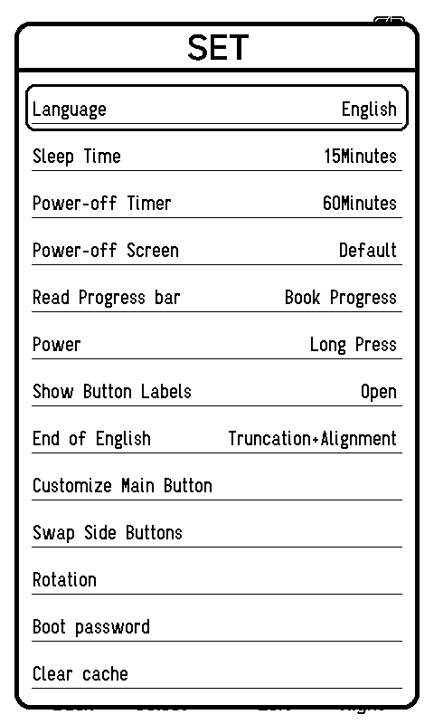

# ESP32 e-reader lab

Automate stock e-reader firmware in Espressif QEMU or `esp-emulator`, inject inputs through GDB, and capture screens for feature comparison with open firmware such as CrossPoint.

This is a research harness. It currently targets the **pinned Xteink X4 stock v5.1.6 application** on ESP32-C3. The application bytes remain unchanged; hardware responses are substituted at version-specific HAL boundaries. The X4 application runs in a constructed flash layout using a public X3 bootloader/data image. It is not an original X4 full dump.

## What works

| Capability | QEMU | esp-emulator v0.45.0 |
|---|---|---|
| X4 home screen, scripted Right/Select | Verified | Verified |
| Settings screen | Verified | Verified |
| Partial display update composition | Verified | Verified |
| Change displayed language | Observed; persistence unverified | Not validated |
| SD-backed EPUB reading and page turn | Verified via sector adapter | Not validated |
| EPUB chapter/menu/bookmark/reopen probes | Verified with diagnostic reader-clock offset | Not validated |
| Physical display/power/timing accuracy | Not validated | Not validated |

Both engines produced byte-identical panel buffers for navigation and Settings. See the [experiment report](REPORT.md), [recorded evidence](evidence/2026-10-04), and [executed EPUB comparison](docs/EPUB_COMPARISON.md).



## Quick start

Requirements: Docker, Python3.12+, and Linux x86_64 containers. Intel macOS was tested. ARM hosts may require Docker's x86_64 emulation; that host configuration has not been validated here.

```sh
git clone https://github.com/lpla/esp32-ereader-lab.git
cd esp32-ereader-lab
python3 scripts/download.py
python3 scripts/prepare.py
docker build -t crosspoint-esp-emulation-lab:2026-10-04 .
python3 scripts/run_lab.py --engine qemu --scenario settings --prefix first-settings
```

For the SD-backed book probe, rebuild the container after updating the repository, then:

```sh
python3 scripts/create_card.py
python3 scripts/run_lab.py --engine qemu --scenario book --card cards/base.img --prefix first-book
```

The source card is copied per run. Firmware cache/bookmark writes go to `results/<run>/card.img`; inspect it using `mtools`, with the FAT partition offset `@@1048576`. Original EPUB/TXT fixtures are generated from source; `create_card.py --fixture beta --name beta` adds the CSS/image probe and `--fixture gamma --name gamma` adds the 120-chapter probe. No privileged mount or physical SD card is needed. See [SD adapter details](docs/SD_ADAPTER.md).

Other scenarios include `baseline`, `right`, `language`, `folder`, `book-page`, `book-controls`, `book-chapters`, `book-chapter-two`, `book-bookmark`, `book-reopen`, and `book-stride-cycle`. See the runner help for diagnostic probes. SD scenarios require `--card`; `book-page` uses the side Down button. Engines: `qemu`, `esp-emu`, `both`. Each prefix must be new so prior evidence is preserved. Reader menu/held-input scenarios use a documented Arduino-millis offset; they are unsuitable for timing or performance measurements.

The runner emits JSON with status and artifact paths. Screens are saved as `results/<run>/screen.png`; individual display writes, logs, commands and hashes accompany them. A successful process/GDB exit alone does not mean a feature passed: inspect the screen and the scenario's actual behavior.

Downloads are pinned and checked against SHA256 hashes. No emulator executables, ROMs, stock firmware, personal flash backups or SD contents are bundled in Git. `download.py` fetches the documented public sources; their licenses/provenance remain separate from this harness. An Internet connection is needed to download/build; guest test containers run with networking disabled.

## How it works

- `scripts/probe.py` controls bounded emulator/GDB sessions in Docker.
- `scripts/x4-*.gdb` supply GPIO/ADC responses and button schedules for the pinned application.
- `scripts/x4-display-capture.gdb` reads display-driver calls without changing their instructions.
- `scripts/render_display.py` retains panel RAM and composes full/partial writes into PNGs using the Python standard library.
- `scripts/wasm_probe.mjs` exercises the published WASM JavaScript API with instruction/time limits (Node18+).

The screenshots represent firmware requests to the display driver. They do not model e-paper waveforms, ghosting, BUSY timing or optical output. Raw framebuffer RAM is reused for partial windows, so repeatedly dumping the same buffer is insufficient.

## Current priority

Use **QEMU** to obtain practical SD/EPUB access and compare reading features. A storage transport adapter is acceptable for this phase: keep the firmware's filesystem, EPUB parser and rendering logic executing, and label the replaced hardware boundary. Complete board emulation and CrossPoint performance measurements come later.

CrossInk comparison is outside the current scope. The [comparison matrix](docs/EPUB_COMPARISON.md) records results for stock v5.1.6 and pinned CrossPoint source, using the same EPUB fixtures. The [native compatibility patch and runner](compat/README.md) make the CrossPoint side reproducible. No full-firmware or physical-device equivalence is claimed.

## Contributing

See [CONTRIBUTING.md](CONTRIBUTING.md). Include the image hash, hook ABI evidence, commands, logs, input sequence and screenshots with new support. Distinguish an original flash image from a constructed fixture, and substituted hardware behavior from feature behavior. Keep timeouts and failed probes visible.

Harness source and documentation are MIT licensed. See [NOTICE.md](NOTICE.md) for third-party firmware, tools and UI evidence.
