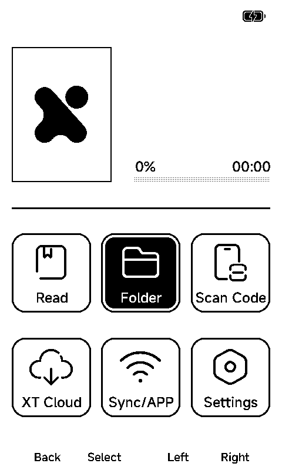

# ESP32 stock firmware emulation experiment

This report preserves the initial engine experiments. Subsequent SD reading and CrossPoint comparisons are recorded in [the executed EPUB comparison](docs/EPUB_COMPARISON.md).

Later work adds [source-backed feature cases and X4 Pro firmware research](docs/SOURCE_FEATURES.md)
and [guest heap/network PR experiments](docs/HARDWARE_PR_TESTING.md). Initial
limitations below are historical observations; consult those reports for new results.

Date: 2026-10-04. Host: Intel macOS; native Linux emulator binaries run in Docker.

## Conclusion

**Automated inspection of closed stock UI is feasible as a prototype. Universal firmware/board support is not established.** We executed stock application binaries, substituted missing hardware responses through GDB, injected button pulses, captured display-driver writes, and composed screenshots including partial updates. No stock application instructions or downloaded binaries were patched on disk.

Both Espressif QEMU and newer `esp-emulator` reached the X4 home screen and responded to a Right pulse by selecting Folder. Their final reconstructed panel buffers are byte-identical: SHA256 `38a00f333f09a32838d1cfaedd22195b2d8694def29f989ab12740aa63ef978e`. See [cross-engine evidence](evidence/2026-10-04/cross-engine-navigation.json).

Both engines also opened Settings, again with byte-identical panel RAM (SHA256 `b812565f2c1f9b1da3b2174bfb60820e1e1ec5a0de4bfb0ad78ba6d726861d40`); see [cross-engine Settings evidence](evidence/2026-10-04/cross-engine-settings.json). QEMU additionally changed its displayed language. These are executed firmware behaviors, not a UI recreation. Storage-backed persistence, books, networking, battery accuracy, display timing and optical refresh were not validated.

This report records the initial research experiment, now published in this standalone harness repository. It is not a CrossPoint simulator integration or a PR. Both firmware and simulator repositories were left unchanged. No device was flashed or recorded, and CrossInk was not compared.

## Pinned inputs and provenance

- Espressif [`esp-emulator` v0.45.0](https://github.com/espressif/esp-emulator/releases/tag/v0.45.0): native Linux x86_64 and WASM packages. README pinned to `8b20ca7c40b8a3d3b2d865984cbc5ed1ddd780b0`.
- Espressif [QEMU `esp-develop-9.2.2-20260417`](https://github.com/espressif/qemu/releases/tag/esp-develop-9.2.2-20260417): Linux RISC-V package, ESP32-C3 machine and supplied mask ROM.
- Public firmware from [`zocs/eink-quick-flasher`](https://github.com/zocs/eink-quick-flasher/tree/79d2f5b8f1df08d2c8fb33146ac5f887790ddb9e/firmware), commit `79d2f5b8f1df08d2c8fb33146ac5f887790ddb9e`. This third-party repository labels the images as stock firmware; manufacturer authenticity was not independently authenticated.
- `x3_en_v5.2.13_full.bin`: 16 MiB full flash, SHA256 `37efcb7db2422b6c7b86b23b2e82b0fb4453ebde350014e7f8e8ad3f06ca2dac`.
- `x4_en_v5.1.6_ota.bin`: 6,368,656-byte application, SHA256 `be3dd62437914ffe7ac23d2713cf63f97f7eccc06fd1cf4b0924e7cce9878822`.

[manifest.json](downloads/manifest.json) records URLs, lengths and hashes. Espressif release checksums were verified. Personal device backups were not used.

Both application image headers identify ESP32-C3 (chip ID 5). The embedded `arduino-lib-builder`/IDF descriptor is not the manufacturer's release version.

### Distinct execution fixtures

| Fixture | Construction and interpretation |
|---|---|
| `x3-stock.bin` | Byte-identical public full image; real bootloader and OTA data. Both engines select app1. |
| `x3-app0-empty-otadata.bin` | Same image with only OTA data at `0xe000..0x10000` erased. Forces app0 through the bootloader; diagnostic fixture. The two application slots contain different payloads, so app0 results must not be assigned the filename's release version. |
| `x4-app-x3-layout.bin` | Both application slots replaced with the **unmodified X4 OTA payload** and erased padding; X3 bootloader, partition table and data retained. This is not a genuine X4 full dump. Inherited settings/data can affect observed behavior. |

Application slots: app0 `0x10000`, app1 `0x780000`, each `0x770000` bytes. Full partition/header descriptions are in [layout.json](evidence/2026-10-04/layout.json). The X4 constructed fixture SHA256 is `8dc0b01a08bb06bb17226289446541b752acb073701841e2b4402919bc206c8d`.

## Executed tests

| Test | QEMU | esp-emulator |
|---|---|---|
| Public X3 full flash, no hardware substitutions | Executes app1; sampled FreeRTOS idle/WFI code. UART is silent. This does not prove UI readiness. | Executes app1; deep-sleep RTC CRC wait followed by interrupt watchdog resets. |
| X3 app0 fixture, no substitutions | Waits for ADC conversion completion. | Released power-button state causes entry into deep sleep; RTC CRC completion never appears. |
| X4 constructed fixture, no substitutions | Waits for ADC conversion completion. | Enters deep sleep and stalls at RTC CRC completion. |
| X3 app0 GPIO/ADC diagnostic responses | Further startup examined; no usable reader feature validated. | Captured a guest framebuffer saying “May be low battery / Powered off”. A trial gauge transport hook was never called and did not resolve this. |
| X4 GPIO/ADC responses + read-only driver capture | Home screen captured; Right selects Folder. | Home screen captured; Right selects Folder; identical panel buffer to QEMU. |
| X4 Settings | Five Right pulses followed by Select open Settings. | Same scenario completed at front-sample330; identical Settings panel buffer. |
| X4 language setting | Another Select changes displayed text from English to Traditional Chinese. Bounded run was interrupted afterward; persistence is unverified. | Earlier35-second sequence stopped at Settings selection, before opening it. A subsequent70-second Settings-only sequence completed. Native language change is not validated. |
| X4 Read | Select produced an additional display write but the final screen remained Home. No book was opened. | Not tested. |
| WASM API, original X3 image | N/A | 300 million requested instructions, about 8.9 s on this host, two watchdog restarts; same RTC CRC stall. No hardware substitutions. |

Evidence directories:

- [Unmodified ESP-EMU X3 execution](evidence/2026-10-04/esp-emu-x3-initial.log), [WASM execution](evidence/2026-10-04/wasm-x3-stock-long/status.json).
- [QEMU baseline runner](evidence/2026-10-04/validated-runner-summary.json).
- [QEMU Right](evidence/2026-10-04/qemu-x4-capture-right/display-writes.json), [ESP-EMU Right](evidence/2026-10-04/esp-x4-right-integer-timeout/display-writes.json).
- [QEMU Settings](evidence/2026-10-04/qemu-x4-settings/display-writes.json), [QEMU language](evidence/2026-10-04/qemu-x4-language/display-writes.json), [QEMU Read](evidence/2026-10-04/qemu-x4-read/display-writes.json).
- [ESP-EMU Settings runner](evidence/2026-10-04/validated-settings-native-summary.json), [Settings comparison](evidence/2026-10-04/cross-engine-settings.json). The earlier interrupted native language experiment is recorded in [validated-native-summary.json](evidence/2026-10-04/validated-native-summary.json).




## Why the diagnostic adapter was necessary

### Power, ADC and deep sleep

The stock X4 GPIO getter at `0x420973e0` reads GPIO input offset `0x3c`; first startup call requests pin 3, returning to `0x42008c3e`. Disassembly and the live breakpoint verify the ABI. `x4-input.gdb` holds Power only during that startup check, then releases it; GPIO6 is treated as display-ready. These are assumptions about hardware state, not optical panel validation.

The stock ADC conversion function at `0x420a1bd4` waits on APB SAR ADC raw interrupt offset `0x44`, ADC1 completion bit 31. QEMU stopped at `0x420a1cae` with ADC base `0x60040000`; X3 app0 has the equivalent wait at `0x420b3288`. The adapter supplies conversion results at the HAL boundary: channel0 raw3200; channel1/2 released4095; Right5 and Select2694 during scheduled front-button samples. These raw values are not a calibrated battery model.

Hardware reference: current FreeInk SDK [BoardConfig.h](https://github.com/Free-Ink/freeink-sdk/blob/aef1a6c89e36f331b2e1aacbbf7ce0debdeb732a/libs/hardware/BoardConfig/include/BoardConfig.h#L892) lines892–922 describe the X4 display/pins; [InputManager.cpp](https://github.com/Free-Ink/freeink-sdk/blob/aef1a6c89e36f331b2e1aacbbf7ce0debdeb732a/libs/hardware/InputManager/src/InputManager.cpp#L29) lines29–45 give measured button values/ranges. These supported the experiment; live screen changes validated Right and Select in this particular stock binary. Other buttons remain unvalidated.

In unmodified ESP-EMU runs, the firmware enters `rtc_deep_sleep_start` and spins waiting for `SYSTEM_RTC_FASTMEM_CONFIG_REG` CRC-finish bit31 at `0x600c0048`. The configuration remains `0x7ff00100`, then the watchdog fires. The mechanism matches ESP-IDF [v4.4.7 rtc_sleep.c](https://github.com/espressif/esp-idf/blob/v4.4.7/components/esp_hw_support/port/esp32c3/rtc_sleep.c). A GDB write to the GPIO input register did not alter the observed input, hence the HAL-return substitution.

### Capturing a real screen requires partial-update composition

The firmware's full RAM buffer is useful for an initial snapshot, but is reused/packed for partial windows. Reading the same 48 KB after a button action yielded a misleading corrupt-looking image. That is not evidence of a corrupt physical screen.

The read-only display breakpoint at `0x42066340` captures the pinned X4 driver's `writeImage` buffer, coordinates, dimensions and inversion/mirroring arguments before SPI transfer. The observed Right update is a `144x480` window at `(392,0)`. [render_display.py](scripts/render_display.py) overlays these rectangles onto retained 800x480 panel RAM and exports a portrait PNG. It validates rectangle bounds and buffer lengths.

This captures what firmware asks the display driver to draw. It bypasses the need to observe SPI transactions, but does not emulate the SSD1677 command stream, waveform selection, BUSY timing, ghosting or physical refresh. If future firmware switches driver, buffering, DMA or framebuffer format, this adapter needs revision.

### Firmware and board coverage

The examined [esp-emulator distribution](https://github.com/espressif/esp-emulator) includes binaries/docs/tools, not the emulator core source. Its CLI and published WASM JavaScript API expose no GPIO-level/ADC-value injection or external SD/e-paper attachment method. Its advertised GP-SPI/I²C support alone does not provide an Xteink board model. The WASM API exposes load/run/register inspection/UART/network methods; it did not provide the GDB substitutions used here.

[QEMU's support matrix](https://github.com/espressif/esp-toolchain-docs/blob/main/qemu/README.md) also leaves relevant peripheral gaps. Its core source is available, making a reusable board/peripheral implementation a possible longer-term route. ESP32 SD/MMC support does not supply an ESP32-C3 SPI SD-card model.

For automatic UI exploration now, the version-bound GDB adapter is usable. For reliable EPUB reading/features, the next requirement is a working SD-card transport with a disposable card image, followed by broader input and display-path coverage. The X3 additionally needs its gauge/controller/board-detection behavior understood. This experiment does not establish support for other SDK models, S3 devices, encrypted firmware, every stock revision, networking services or arbitrary forks.

## Reproduce and use from an agent

From the repository root, with Docker running and Python3.12+ available:

```sh
python3 scripts/download.py
python3 scripts/prepare.py
docker build -t crosspoint-esp-emulation-lab:2026-10-04 .

python3 scripts/run_lab.py --engine both --scenario right --prefix my-right
python3 scripts/run_lab.py --engine qemu --scenario settings --prefix my-settings
python3 scripts/run_lab.py --engine esp-emu --scenario settings --prefix my-native-settings
python3 scripts/run_lab.py --engine qemu --scenario language --prefix my-language
python3 scripts/run_lab.py --engine both --scenario baseline --prefix my-baseline
```

`run_lab.py` emits JSON containing hashes, execution status, artifact paths, capture counts and diagnostic flags. Each run writes `command.json`, `probe.gdb`, `gdb.log`, `uart.log`, `status.json`, plus display-write metadata/data and composed PNGs where reached. It refuses to overwrite a result directory and guards the X4 OTA hash and both installed application slots before using version-specific addresses.

For WASM, use Node18+; on this host the bundled executable is `node`:

```sh
node scripts/wasm_probe.mjs firmware/x3-stock.bin my-wasm 300000000
```

Native runs use isolated, network-disabled containers with CPU/RAM limits, no host devices and no privileged mode. QEMU uses `-snapshot`; ESP-EMU is not asked to save flash state. The harness checks that the flash image hash remains unchanged. Captured SD/flash persistence has not been checked; an unchanged image is expected from these isolation settings.

The scenarios currently schedule raw ADC samples; they are a small automation prototype, not a persistent interactive agent server. They can be extended to scripted actions/screens at these pinned addresses. Generalizing to arbitrary firmware requires identifying/revalidating the HAL/driver ABI or implementing a real board model.

## Verification boundaries and harness pitfalls

- A GDB return code0 means the probe script completed, **not** that a firmware feature passed. Inspect screenshots and logs. Nonzero/timeout/interrupted runs remain explicitly labelled.
- The successful Right runs finish at front-sample100, GPIO-call185 and ADC-call239 in both engines, with byte-identical panel RAM. They do not depend on an arbitrary wall-time screenshot.
- Settings also matches byte-for-byte across engines. Native GDB-driven scenarios run more slowly here; the runner allows70seconds before interrupting the native probe. A trial with6-sample pulses instead of20 was ignored in QEMU and is retained only as an unsuccessful experiment, not used by the runner.
- The ESP-EMU duration parser treated a fractional string such as `45.0s` as an approximately5-second run in an exploratory probe. The harness now formats integer durations as `45s`; that corrected run completed Right navigation. Earlier short-budget exploratory runs are retained but do not count as completed navigation.
- Opening/disconnecting a readiness socket resumes ESP-EMU. The harness now lets GDB own the first connection.
- QEMU UART silence was checked with GDB rather than classified as a boot failure.
- The X3 slots have different code. Disassembly addresses must be matched against live bytes and the selected slot; initial probes at app0 addresses while app1 was selected timed out and were rejected.
- All screenshots are emulator/diagnostic-adapter evidence. No physical e-paper, timing, power or device validation is claimed.

No production firmware changes, embedded heap allocations or PlatformIO builds were required. Python scripts compile, pinned downloads prepare successfully, the runner executes all three QEMU baseline fixtures, and both native engines execute the demonstrated X4 navigation.
