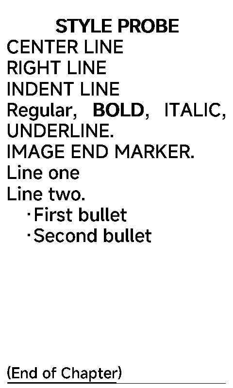
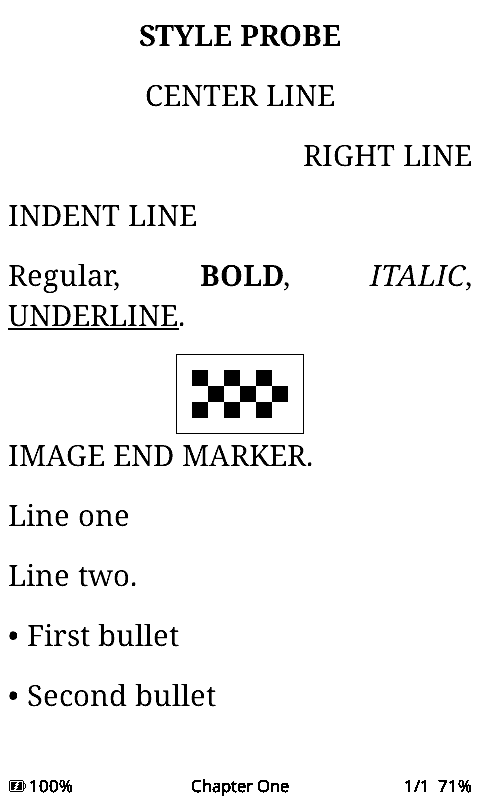

# Executed EPUB comparison — 2026-10-04

## Result and scope

The follow-up [source-driven audit](SOURCE_FEATURES.md) adds manual-backed
dark/font/orientation cases and wider X4 Pro/Licorice research. Its catalogue
separates observed results from documented claims and user requests.

SD/EPUB access works in QEMU with a sector adapter. The stock application's own FAT filesystem, ZIP reader, EPUB parser and renderer execute. Both firmwares open the same generated EPUB, turn pages, select Chapter Two, add a bookmark, and restore the displayed page after leaving and reopening the book in the same process. CrossPoint additionally renders the tested image and styles, and its internal-link jump/return works.

This is an initial reading-feature comparison, not an exhaustive audit of all closed firmware. CrossInk is excluded. Use **Espressif QEMU** for further SD work: both tested engines reached Home/Settings, but QEMU was more convenient and the storage adapter is only validated there. Full peripheral accuracy and performance measurements are deferred.

## Pinned subjects

| Subject | Identity |
|---|---|
| Stock X4 application | Public flasher label `x4_en_v5.1.6_ota.bin`; SHA256 `be3dd62437914ffe7ac23d2713cf63f97f7eccc06fd1cf4b0924e7cce9878822` |
| Constructed flash | SHA256 `8dc0b01a08bb06bb17226289446541b752acb073701841e2b4402919bc206c8d` |
| QEMU | Espressif `esp-develop-9.2.2-20260417` |
| CrossPoint | `223c20b4864da9e7ee400d8234f7544fbbe54b62` |
| FreeInk SDK | `aef1a6c89e36f331b2e1aacbbf7ce0debdeb732a` |
| Native simulator | `62ec1eccf480b6f23e54cdd1c70805b3c460c217`, plus [compatibility patch](../compat/simulator-x4-reading.patch) |
| Tested native executable | Intel macOS; SHA256 `57ca2e54ae11f397c964c77f568d3967512ebdad60ebf3f5081ce4a37ce93951` |

The stock application is unchanged, but it runs with an X3 bootloader/data layout and inherited settings, not an authenticated original X4 full dump. The public flasher's manufacturer attribution was not independently authenticated. Results apply to these bytes and this setup. See [provenance](../REPORT.md) and [adapter contracts](SD_ADAPTER.md).

CrossPoint was tested as native source, not as an ESP32 machine-code image. The compatibility patch supplies host API bindings; it does not change its EPUB parser/rendering. The native image build uses real PNGdec/JPEGDEC rather than simplified host decoder output. Networking, encryption, hardware RAM limits and device speed are outside this comparison. [Build and runner details](../compat/README.md).

## Fixtures

All books are original, generated from committed source. EPUB archives/binaries are excluded from Git.

| Fixture | Purpose | SHA256 |
|---|---|---|
| ALPHA | Two chapters, pagination, bold/italic/underline, internal link to `second.xhtml#note` | `9cfb793219cb30489e65e5568a469b0f2958be70ce44ed175fdcc220121ba604` |
| BETA | External CSS center/right/indent, styles, 128×80 one-bit PNG, line break and bullets | `7f36a1727e0f1821e04581ca7f46e00441b0f109843693efbe100d6ba9737fa5` |
| GAMMA | 120 short chapters and NCX entries for chapter navigation | `6024897e5383a73ee944c0d96a194ed020614b22acfa969ffc83bc7ad26c6df3` |

BETA's image is a known border/checker pattern, not a screenshot placeholder. XML, manifest/spine references, mimetype ordering, deterministic generation and fixture hashes are checked by host tests.

## Observations

“Observed absent” means absent in these captured cases; it does not establish a global firmware limitation.

| Feature | Stock X4 v5.1.6 fixture | CrossPoint source simulator | Evidence |
|---|---|---|---|
| Open EPUB / render known text | Pass | Pass | [Stock](../evidence/2026-10-04/sd-book/screen.png), [CrossPoint](../evidence/2026-10-04/crosspoint-reading-current/book.png) |
| Page turn | Pass; new numbered paragraphs | Pass; new paragraphs/page counter | [Stock](../evidence/2026-10-04/sd-page-capture-qemu-x4-app-x3-layout-book-page/screen.png), [CrossPoint](../evidence/2026-10-04/crosspoint-reading-current/page.png) |
| TOC and select Chapter Two | Pass | Pass | [Stock target](../evidence/2026-10-04/stock-chapter-two/screen.png), [CrossPoint target](../evidence/2026-10-04/crosspoint-toc/chapter-two.png) |
| Bold | Rendered | Rendered | BETA screens below |
| Italic / underline | Observed absent | Rendered | BETA screens below |
| Embedded one-bit PNG | Observed absent | Actual PNG decoded/rendered | BETA screens below; [decoder log](../evidence/2026-10-04/crosspoint-css/uart.log) |
| External CSS center / right | Both lines left aligned | Correct with Book's Style selected | BETA screens below |
| CSS `text-indent:2em` | Observed absent | Expected indent not established by this capture | No correctness claim |
| Explicit line break / unordered bullets | Rendered | Rendered | BETA screens below |
| Internal link/footnote jump and return | `[1]` rendered; no equivalent action reached in tested menu | Target reached; Back restores source | [CrossPoint target/return](../evidence/2026-10-04/crosspoint-links-current); stock link activation remains unverified |
| Bookmark through held Confirm | “Bookmark Added” observed | “Bookmark added” and one bookmark saved, with action configured | [Stock](../evidence/2026-10-04/stock-bookmark-current/screen.png), [CrossPoint](../evidence/2026-10-04/crosspoint-bookmark/bookmark.png) |
| Close/reopen reading position | Pre-exit/reopened panel byte-identical | Pre-exit/reopened screenshot byte-identical; progress cache loaded | [Stock](../evidence/2026-10-04/stock-reopen), [CrossPoint](../evidence/2026-10-04/crosspoint-reopen) |
| TOC jump multiplier | Captured ×1, ×10, ×100 controls | Held navigation pages by visible list rows | [Stock controls](../evidence/2026-10-04/stock-stride-cycle); see assessment below |

### Same BETA EPUB

Stock:



CrossPoint with Book's Style:



CrossPoint defaults to justified alignment. Its explicit user setting overrides EPUB CSS; that is intentional, not a center/right rendering regression. [CrossPoint BlockStyle.h lines142–147](https://github.com/lpla/crosspoint-reader/blob/223c20b4864da9e7ee400d8234f7544fbbe54b62/lib/Epub/Epub/blocks/BlockStyle.h#L142-L147) and [default setting line299](https://github.com/lpla/crosspoint-reader/blob/223c20b4864da9e7ee400d8234f7544fbbe54b62/src/CrossPointSettings.h#L299). The `media-css` runner explicitly sets `paragraphAlignment=4` and `embeddedStyle=1`; [default-mode capture](../evidence/2026-10-04/crosspoint-default-css/style.png) is retained too.

Held-Confirm bookmarking is configurable and disabled by default in the tested CrossPoint source. The bookmark scenario sets `longPressMenuFunction=2`; [source default](https://github.com/lpla/crosspoint-reader/blob/223c20b4864da9e7ee400d8234f7544fbbe54b62/src/CrossPointSettings.h#L325) and [handler](https://github.com/lpla/crosspoint-reader/blob/223c20b4864da9e7ee400d8234f7544fbbe54b62/src/activities/reader/EpubReaderActivity.cpp#L578-L590). Its menu also exposes Toggle Bookmark. This is already implemented, so it does not justify another feature patch.

## Assessment for CrossPoint

The exercised opening, pagination, chapter selection, bookmarks and reopen features already exist. The observed style/image differences favor CrossPoint, so no new implementation is warranted for those cases.

The stock chapter selector's explicit ×1/×10/×100 choice is a useful candidate for very large TOCs. The [current CrossPoint list navigation](https://github.com/lpla/crosspoint-reader/blob/223c20b4864da9e7ee400d8234f7544fbbe54b62/src/activities/UiListActivity.cpp#L97-L113) jumps by measured visible rows on a held button; [chapter selector](https://github.com/lpla/crosspoint-reader/blob/223c20b4864da9e7ee400d8234f7544fbbe54b62/src/activities/reader/EpubReaderChapterSelectionActivity.cpp#L14-L20) uses that shared list behavior. The native GAMMA run moved from Chapter001 to017 with held navigation ([capture](../evidence/2026-10-04/crosspoint-gamma/held-navigation.png)). The stock follow-up displayed ×100 but the attempted jump reached Chapter003 instead of101 ([inconclusive probe](../evidence/2026-10-04/stock-stride-jump-inconclusive/screen.png)). Input/focus semantics remain unresolved; the control's presence is established, its100-chapter jump is not. Do not treat that failed attempt as a stock firmware defect or a proven gap in CrossPoint.

If that behavior is validated and useful, a separate adjustable chapter stride would need only a small scalar state, no additional heap buffer, but UI/i18n and orientation behavior need design and validation. This lab has not modified CrossPoint to add it.

The [manufacturer's current X4 guide](https://cdn.shopify.com/s/files/1/0759/9344/8689/files/X4_User_Guide.pdf?v=1783668551) describes chapter jumps up to100 and other reader controls. That document may describe a different firmware revision; its claims are a test backlog, not executed evidence for v5.1.6.

## Reproduce

After the root quick start:

```sh
python3 scripts/create_card.py --fixture alpha --name alpha
python3 scripts/run_lab.py --scenario book-page --card cards/alpha.img --prefix alpha-page
python3 scripts/run_lab.py --scenario book-chapter-two --card cards/alpha.img --prefix alpha-chapter
python3 scripts/run_lab.py --scenario book-bookmark --card cards/alpha.img --prefix alpha-bookmark
python3 scripts/run_lab.py --scenario book-reopen --card cards/alpha.img --prefix alpha-reopen
python3 scripts/create_card.py --fixture beta --name beta
python3 scripts/run_lab.py --scenario book --card cards/beta.img --prefix beta-styles
python3 scripts/create_card.py --fixture gamma --name gamma
python3 scripts/run_lab.py --scenario book-stride-cycle --card cards/gamma.img --prefix gamma-controls
```

CrossPoint's [compatibility/build instructions](../compat/README.md) show how to build the tested native target. Then:

```sh
python3 scripts/run_crosspoint.py --binary ../crosspoint-reader/.pio/build/simulator_reading_images/program --firmware-repo ../crosspoint-reader --scenario links --prefix cp-links
python3 scripts/run_crosspoint.py --binary ../crosspoint-reader/.pio/build/simulator_reading_images/program --firmware-repo ../crosspoint-reader --scenario media-css --prefix cp-css
```

Additional native scenarios: `reading`, `toc`, `bookmark`, `reopen`, `media`, `chapters`. Each run uses a fresh synthetic SD directory. Stock runs copy a source card. Input scripts, process status, display writes and sector logs remain in `results/`. Inspect the screen and expected text; a zero exit alone is not a feature pass. `archive_evidence.py RUN LABEL` exports selected PNGs/logs/metadata and hashes, excluding binaries and storage images.

## Limits and remaining tests

Reader controls need a diagnostic Arduino-millis offset because sample-counted ADC pulses otherwise represent only a few virtual milliseconds. This changes software time perception and can repeat held page turns. It does not change the underlying ESP timer. It is explicitly recorded and invalidates performance, auto-flip interval, debounce and timing claims. See [clock contract](SD_ADAPTER.md#reader-input-clock).

Stock reopen matched `screen-018.png` to the final screen; CrossPoint `page.png` matched `reopen.png`. This proves same-run restoration only. QEMU uses flash snapshot mode, so NVS writes do not persist between runs. SD writes remain in the result card, but reboot restoration, bookmark reopening/deletion and power loss are not validated. Stock `XTCache/.../config.json` contains font/settings data; it should not be mistaken for proven progress storage.

Remaining reading work: confirm stock internal-link activation, test more image formats/bit depths, EPUB3/nested TOCs, font/spacing/progress options, malformed/large books and cache invalidation. Bluetooth, connectivity, encrypted books, all stock versions/models and other proprietary firmware are untested. Full machine emulation and ESP32 performance/resource tests are a later phase. Physical e-paper output was not tested.
