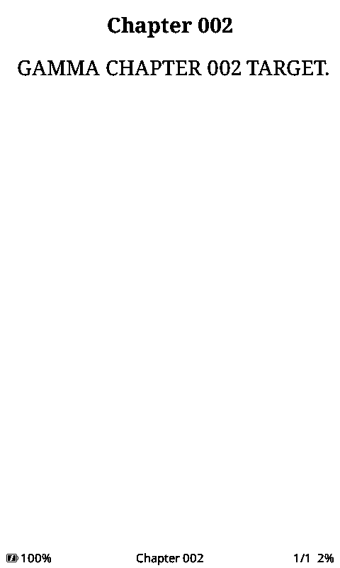

# Full CrossPoint machine workloads and PR evidence — 2026-10-04

Follow-up: [current regression runners and corrected checkpoint contract](REGRESSION_RUNNERS.md).

New follow-up: [older PR/issue experiments](HISTORICAL_TESTS.md) and
[scope-aware feature investigation](FEATURE_SCOPE.md).

Both Espressif QEMU and esp-emulator now run the **full embedded CrossPoint C3
firmware**, including cold EPUB indexing/layout, SD cache writes, a page turn,
reader exit and guest heap diagnostics. These are machine-emulator workloads
with explicit board-transport adapters. The native simulator remains useful for
fast UI tests; the machine path adds the target allocator/FreeRTOS behavior.
These improvements are lab runners and board adapters; no emulator-core fork
was created in this phase.

## Executed control

CrossPoint `223c20b4864da9e7ee400d8234f7544fbbe54b62`, freeink-sdk
`aef1a6c89e36f331b2e1aacbbf7ce0debdeb732a`, unmodified `default` environment,
Arduino 3.3.11 / ESP-IDF 5.5.5. The [full build log and provenance](../evidence/2026-10-04/machine-build)
record a successful build. No source changes were made in the user's checkout.

The merged factory image's 5,885,056-byte prefix is preserved, padded with FF to
16 MiB. Executed image SHA256:
`87dabf5962969615adc8d776ce20b3b54cb5d5d0b6795f1f84cd4b9d7932a948`.
Executed ELF SHA256:
`cee8ed02a1e0867294fa31c57dab318269ef53ffeacd713c7faf1c47f3077f88`.
Build timestamps can change a rebuild's hashes. The preparation script extracts
addresses from that build's ELF and checks the required object offsets with
DWARF; the runner checks source/SDK pins and the packaged image/ELF hashes.

GAMMA has 120 spine/TOC entries and explicit numbered text markers. Its EPUB hash
is `6024897e5383a73ee944c0d96a194ed020614b22acfa969ffc83bc7ad26c6df3`.
A fresh disposable FAT card is seeded with documented reader-resume state. The
firmware itself opens the book, creates metadata/layout caches, and saves
progress. The `turn-exit` scenario drives side Down then Back using the guest
FreeRTOS tick count, without changing the clock or logical input mapping.

| Matched checkpoint / result | QEMU | esp-emulator |
|---|---:|---:|
| First page | GAMMA CHAPTER 001 TARGET | Same |
| Next page, then exit | CHAPTER 002 TARGET → Home | Same |
| Free / largest after first page | 153,792 / 114,676 B | Same |
| Since-boot minimum after first page | 86,992 B | Same |
| Free / largest after second page | 153,536 / 114,676 B | Same |
| Free / largest on Home after exit | 143,548 / 114,676 B | Same |
| Since-boot minimum after turn/exit | 86,380 B | Same |
| Logical SD reads / writes, first-page run | 806 / 155 sectors | Same |
| Logical SD reads / writes, turn/exit run | 950 / 225 sectors | Same |

The configured guest reports 264,700 B total in this heap diagnostic, not a
synthetic 1 MiB simulator heap. Home after exit retains recent-book/UI/cache
state; its difference from a fresh Home boot is not a leak diagnosis. Low-water
marks include cold opening and temporary grayscale buffers, not just idle state.

First-page PNGs are byte-identical, SHA256
`68195485098e0458a662c3ca5dcbf308a21ac2a53a226505b3fc794efa640d1e`.
Final Home PNGs are byte-identical, SHA256
`c8a899a9b2af6f74825037aacd1d1b9da6c0a6bedf478f91d1f26652b4407434`.
Individual captures establish Chapter002 before exit. The final ELF-symbol-based
adapter repeats the same turn/exit figures and screen hashes.

- [First-page comparison](../evidence/2026-10-04/machine-compare-read.json)
- [Turn/exit comparison](../evidence/2026-10-04/machine-compare-turn-exit.json)
- [Final symbol-profile comparison](../evidence/2026-10-04/machine-symbol-profile-compare.json)
- [QEMU execution](../evidence/2026-10-04/machine-symbol-profile-qemu)
- [esp-emulator execution](../evidence/2026-10-04/machine-symbol-profile-esp)



## What the adapters replace

The [board adapter](../scripts/crosspoint-board.gdb) supplies SD sector transport
and card-begin state, ADC samples, digital GPIO, panel SPI/BUSY completion, and
USB logging transport. It simulates the **AfterFlash** boot classification;
power/wake verification is outside this scenario. Heap allocation, FreeRTOS,
HAL storage mutexes, FAT/ZIP/XML/CSS/EPUB processing, caches, fonts and framebuffer
allocation execute in the guest. Arduino ADC initialization/calibration code
executes; the sample boundary is `adc_oneshot_read`.

The adapter observes display submission, not optical output. Lower SD driver
initialization/allocations and panel timing are omitted. Interrupt timing,
physical SD/DMA, storage-driver races, deep sleep, RF and e-paper waveforms need
a different test. Retaining the HAL mutex does not prove hardware race coverage.

Existing `[MEM]` logging is brought forward by setting `loop()::lastMemPrint`
after a paint/render. This changes diagnostic scheduling, not time or the heap
API. The runner stops after the matched diagnostic. Keep identical logging
instrumentation for future A/B builds. No additional guest heap arena or host
allocator substitution is introduced by the adapter.

QEMU reports a 51 ms first-page render here; esp-emulator reports 26 ms. These
are **modeled timing**, affected by different CPU/peripheral models and GDB
transport. They establish neither a device speed comparison nor a PR speedup.
Allocation/contiguity, exact page output and logical SD operation counts are the
useful reproducible controls today. Logical sector counts are not physical SD
latency or the number of high-level metric lookups.

## QEMU bring-up fixes and debug support

The independent modern-IDF probe initially failed before setup: the flash-init
function returned `ESP_ERR_INVALID_RESPONSE` (0x108), followed by the startup
assertion. QEMU selects different flash chip models by image size; padding its
4 MiB probe to a 16 MiB physical model reached setup without overriding the flash
API. The probe's software flash configuration remains 4 MiB; that experiment is
a devkit control. Full CrossPoint uses a matching 16 MiB configuration/model.
[QEMU board source](https://github.com/espressif/qemu/blob/esp-develop/hw/riscv/esp32c3.c)
and [C3 documentation](https://github.com/espressif/esp-toolchain-docs/blob/main/qemu/esp32c3/README.md)
explain the model and execution options. The precise GD25 command/driver mismatch
has not been diagnosed.

QEMU's independent probe also needs a UART write observer to expose diagnostics.
With that transport adapter, its **real allocator** demonstrates the same
fragmentation control as esp-emulator: 134,316 B free but only a 2,292 B largest
block, a failed 3,316 B request, then exact baseline recovery and valid integrity.
[Recorded guest output](../evidence/2026-10-04/qemu-c3-heap-uart).

The full reader's earlier QEMU reset was captured as an interrupt watchdog in
`adc_oneshot_hal_convert`, polling an ADC completion event. The first adapter
covered `analogRead` but missed the battery's `analogReadMilliVolts` route.
Moving the sample boundary to `adc_oneshot_read` fixed both routes. The [failed
context](../evidence/2026-10-04/machine-qemu-adc-watchdog) is preserved; it is not a
CrossPoint crash finding.

Ubuntu GDB 15 crashed when connecting with this full DWARF ELF, including when
loaded before connection. `objcopy --strip-debug` preserves symbols/loadable code
and avoids that debugger crash in the tested probe. `probe.py --elf` can load
such a symbol-only ELF; [successful inspection](../evidence/2026-10-04/qemu-stripped-symbols).
The runner itself derives symbols offline and needs no remote DWARF connection.

## Stock large-TOC investigation

The [X4 manual, printed p.7](https://cdn.shopify.com/s/files/1/0759/9344/8689/files/X4_User_Guide.pdf?v=1783668551)
claims jumps of up to 100 chapters. Its publication firmware is unspecified;
executed stock application is v5.1.6. Treat the claim as version-scoped.

The deterministic GAMMA cases isolate these hypotheses:

| Input hypothesis | Observed result | Verdict |
|---|---|---|
| Confirm focused Down×100 | List remains at Chapters001–009 | No target established |
| Hold Confirm on Down×100 | Same visible list | No target established |
| Locate means numeric target entry | Highlight moves from footer to Chapter001; no numeric dialog | Hypothesis rejected for this sequence |
| Short front row navigation after ×100 | Confirm opens Chapter002 | Ordinary selection passes; target101 fails |
| Side Down uses multiplier | Held samples scroll list pages repeatedly | Input-repeat/page behavior; no 100-chapter claim |
| Longer front hold uses multiplier | Injected 1.6/4.0 s increments end at Chapters028/065 | No exact101 jump established |
| Down×100 applies on menu close | Returns to reader menu showing Chapter001 | No target established |

[Locate capture](../evidence/2026-10-04/stock-toc-locate),
[wrong target002](../evidence/2026-10-04/stock-toc-wrong-target),
[long hold](../evidence/2026-10-04/stock-toc-held-four-seconds),
[Down× hold](../evidence/2026-10-04/stock-toc-down100-hold), and
[side-button repeat](../evidence/2026-10-04/stock-toc-side-page-repeat)
retain inputs and intermediate screens. Arduino millis includes an explicitly
injected offset; these are functional UI investigations, not timing tests.
Negative sequences do not show that the stock feature is absent or defective.
The ×100 control is present; its precise activation contract remains unresolved.

For these investigations QEMU now has [guest-resident ADC/GPIO/millis stubs](../adapters/rv32_io.S)
that replace thousands of debugger round trips with a bounded schedule and one
terminal breakpoint. Runtime code patches and RTC scratch are recorded; the
on-disk firmware stays unchanged. This adapter changes runtime instructions at
hardware boundaries and is unsuitable for performance measurements. It is
validated **only in QEMU**. The newer emulator's attempt watchdogs before front
polling; [failure preserved](../evidence/2026-10-04/stock-esp-fast-input-watchdog).
Use its default breakpoint adapter instead.

CrossPoint's source already supports held movement by measured visible rows
([UiListActivity.cpp:97–113](https://github.com/crosspoint-reader/crosspoint-reader/blob/223c20b4864da9e7ee400d8234f7544fbbe54b62/src/activities/UiListActivity.cpp#L97-L113))
and a bounded 24-row SD-backed TOC window
([chapter activity:55–71](https://github.com/crosspoint-reader/crosspoint-reader/blob/223c20b4864da9e7ee400d8234f7544fbbe54b62/src/activities/reader/EpubReaderChapterSelectionActivity.cpp#L55-L71),
[header:13–25](https://github.com/crosspoint-reader/crosspoint-reader/blob/223c20b4864da9e7ee400d8234f7544fbbe54b62/src/activities/reader/EpubReaderChapterSelectionActivity.h#L13-L25)).
An optional numeric chapter target could use fixed scalar input and reuse that
window, without allocating a full TOC. That is a design candidate, not a proven
stock advantage or an implemented CrossPoint PR. Nested NCX/nav entries require
an explicit TOC-index versus spine-index contract before implementation.

## PR-specific execution and review scope

[#3612](https://github.com/crosspoint-reader/crosspoint-reader/pull/3612), exact head
`85ff81e8aab78533476f4db57986f71f18ee231a`, now has an expanded guest A/B.
The unchanged module is installed twice on each of three fresh STA netifs. Both
builds complete three HTTP requests. Candidate TCP DF is 18/18, baseline 0/18;
UDP is 3/3 without DF in both, with zero invalid IPv4 checksums.

Eleven synthetic packet cases per build execute through the installed output
callback on the actual lwIP task: whole/unaligned TCP, options, already-DF, MF,
fragment offset, UDP, non-v4 tag, invalid IHL, truncation and split pbuf header.
Whole valid TCP is changed only in the candidate; the preservation cases remain
byte-identical. Synthetic packets terminate at the observer sink, while the
HTTP/UDP workload uses modeled networking. Fixed metadata and small fallible
pbuf allocations keep the control bounded. No allocator or PR callback is
reimplemented. [Machine-checked comparison](../evidence/2026-10-04/tcp-edge-comparison.json),
[base](../evidence/2026-10-04/tcp-edge-base),
[candidate](../evidence/2026-10-04/tcp-edge-patched),
[build/provenance](../evidence/2026-10-04/tcp-edge-build).

[#3702](https://github.com/crosspoint-reader/crosspoint-reader/pull/3702), exact head
`695d71298cbfb418f88a9dff1f7a6da22ad9e800`: **9/9 exact-head host decoder/replay
tests pass**. [Source hashes and result metadata](../evidence/2026-10-04/pr3702-host).
Guest hooks, unwinding, ring overflow and tracing-off parity have not been run.
Tracing has a substantial footprint; normal-build A/B must precede diagnostic
traces. Host tests are not a guest-tracer verdict.

[#3831](https://github.com/crosspoint-reader/crosspoint-reader/pull/3831) and draft
[#3705](https://github.com/crosspoint-reader/crosspoint-reader/pull/3705) remain
**untested candidates**. This reader control uses built-in fonts, so it does not
exercise their SD-font caches. They need exact base/head builds, matching SDKs,
pinned .cpfont/EPUB bytes, uniform and varying-width fonts, matched allocation
phases, glyph/kerning/landing comparisons and repeated/background layout. The
new symbol/offset derivation reduces adapter work, but does not automatically
support different SDKs. #3705's acknowledged varying-width regression and
contiguity tradeoff remain unresolved by this lab.

[#2127](https://github.com/crosspoint-reader/crosspoint-reader/pull/2127) remains
**untested as an application candidate**. Existing station reconnects do not
execute its WebServerActivity lifecycle. Use esp-emulator for requests before
and after lost STA/reconnect, changed-IP handling, timeout/exit cleanup and AP
non-regression. QEMU's documented Wi-Fi limitation remains. Physical carrier/RF
claims are unvalidated for all these network tests.

Local COMMENT drafts for those five PRs were prepared without posting to GitHub.
Only #3612 has candidate guest evidence; #3702 has host evidence. None is an
approval based on emulator behavior. The earlier [PR testing report](HARDWARE_PR_TESTING.md)
retains the initial experiments and detailed limitations.

## Reproduce

After the repository's standard download/container/card preparation, with
PlatformIO installed:

```sh
python3 scripts/prepare_machine.py
python3 scripts/run_machine.py --engine qemu --name my-qemu-reader \
  --card cards/gamma.img --book /gamma.epub --scenario turn-exit --seconds 120
python3 scripts/run_machine.py --engine esp-emu --name my-esp-reader \
  --card cards/gamma.img --book /gamma.epub --scenario turn-exit --seconds 120
python3 scripts/check_machine.py results/my-qemu-reader results/my-esp-reader
```

`prepare_machine.py --package` packages an already-built clean pinned checkout,
extracts symbols and validates DWARF object offsets. Source/SDK changes require
explicit ABI work; do not borrow another build's addresses. Unique run names
preserve previous evidence. The machine verdict checks a completed render and
heap checkpoint; inspect the screen for the semantic marker as well.

Expanded packet tests:

```sh
python3 scripts/prepare_soc.py
pio run -d probes/esp32c3 -e c3_edges -e c3_df_edges
python3 scripts/prepare_soc.py --images --edges
# Run each with probe_soc.py inside the prepared container, as in HARDWARE_PR_TESTING.md.
python3 scripts/check_soc.py results/tcp-edge-base/status.json \
  results/tcp-edge-patched/status.json --require-edges
```

Faster stock TOC probes:

```sh
python3 scripts/run_feature.py cases/toc-long100-four-seconds.json \
  --card cards/gamma.img --prefix my-stock-toc --fast-inputs
```

A zero exit code is never a semantic feature verdict. Timeouts/watchdogs and
negative hypotheses remain in the evidence. Optical/RF/SD electrical behavior,
physical performance and S3/X4 Pro support remain outside these C3 controls.
